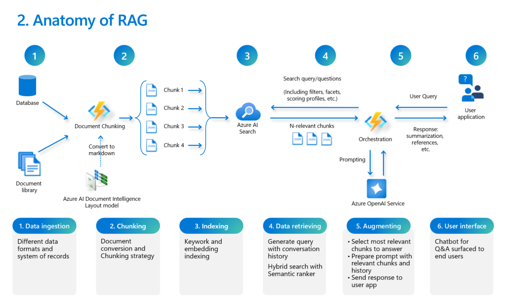

# RAG Workshop

RAG (Generación Aumentada por Recuperación) es una arquitectura avanzada de IA que combina el poder de la recuperación de información con modelos de IA generativa. La idea clave es mejorar la salida del modelo de IA generativa recuperando información relevante de una colección de documentos o fuentes de datos. Este enfoque mejora la precisión y relevancia del contenido generado al fundamentarlo en datos del mundo real.

El propósito de este repositorio es reflejar el proceso de RAG en un taller práctico, siguiendo las mejores prácticas, junto con herramientas y técnicas para pruebas y evaluación.

Este documento está dividido en secciones que siguen el orden estándar de implementación para una implementación de extremo a extremo de una solución RAG con fines de aprendizaje.

## Cómo usar este repositorio

Este repositorio está diseñado como un recurso integral de aprendizaje para construir una implementación de Generación Aumentada por Recuperación (RAG) utilizando modelos de IA generativa y un motor de búsqueda. Ya sea que seas nuevo en estos conceptos o busques perfeccionar tus habilidades, puedes adaptar tu experiencia según tus necesidades. Tienes la flexibilidad de profundizar en secciones específicas, utilizando los cuadernos y la guía proporcionada para explorar temas particulares en profundidad. Este enfoque te permite aprovechar los recursos del repositorio para abordar desafíos o preguntas específicas que puedas encontrar en tus proyectos.

Alternativamente, si buscas una comprensión holística de las implementaciones de RAG, puedes seguir el repositorio de manera secuencial. Al proceder a través de las secciones en orden, obtendrás una visión paso a paso de todo el proceso, desde conceptos fundamentales hasta técnicas avanzadas. Este camino es ideal para aquellos que desean una revisión completa de extremo a extremo, asegurando una comprensión exhaustiva de cómo construir y optimizar sistemas RAG. Cualquiera que sea el enfoque que elijas, este repositorio sirve como una valiosa herramienta educativa para mejorar tu conocimiento y habilidades en esta área de vanguardia.

Los ejemplos de conexiones de fuentes de datos se pueden personalizar a tus propias fuentes:
- Conexión a base de datos PostgreSQL: puede configurar los parámetros de conexión a su base de datos en el fichero .env
- Conexión a base de datos a través de un endpoint API REST: en el repositorio se incluye una base de datos SQLite de muestra y una pequeña configuración de endpoint con flask.
- Archivos PDF de muestra en la carpeta 'docs'.

**Presentación con explicación de RAG y detalles del Workshop**
[RAG_workshop.pdf](RAG_workshop.pdf)

## Componentes clave:
- Indexación: crear índices de búsqueda de IA, procesar documentos fragmentándolos e indexándolos. En este repositorio hay dos tipos de fuentes de datos para indexar:
   + una base de datos PostgreSQL accesible a través de su host, usuario y password.
   + una base de datos SQLite accesible a través de un endpoint configurado con flask.
   + Ficheros PDF en la carpeta 'docs'.
- **Búsqueda y Recuperación**: La solución recupera con búsqueda híbrida y la función Semantic ranker de Azure AI Search los documentos o fragmentos indexados más relevantes para la pregunta del usuario. Este paso asegura que las respuestas generadas estén informadas por información curada.
- **Aumento**: La información recuperada se revisa semánticamente comparada con la pregunta del usuario para seleccionar solo los fragmentos más relevantes. Este aumento ayuda a producir respuestas contextualmente precisas e informativas.
- **Generación de Respuestas**: Finalmente, el modelo de IA generativa, en este caso el modelo GPT de Azure Open AI, genera respuestas o contenido basado en el contexto proporcionado por los fragmentos más relevantes. Se incluyen dos opciones: sin y con el histórico de conversación en la generación de respuestas.
- **Evaluación**: analizar las respuestas y el contexto para evaluar la similitud con una verdad de referencia (con respuestas esperadas a preguntas específicas) y si la respuesta estaba fundamentada en el contexto o no.
- **Aplicación de demo**: se proporciona una aplicación web sencilla de demo (rag_chat.py) para realizar consultas sobre los contenidos indexados.
   + Para arrancar la aplicación ejecuta el siguiente comando: `streamlit run rag_chat.py`

## Cómo funciona RAG en Azure
En esta implementación, aprovechamos los Servicios de IA de Azure para construir una solución RAG. Los servicios clave para este repositorio son:
- **Azure AI Search**: Un robusto servicio de búsqueda que ayuda a recuperar información relevante de un gran corpus, asegurando que el modelo generativo tenga acceso a los datos más pertinentes. Más información: https://learn.microsoft.com/en-us/azure/search/
- **Azure Open AI Service**: Proporciona modelos generativos de última generación capaces de entender y generar texto similar al humano. Más información: https://learn.microsoft.com/en-us/azure/ai-services/openai/
- **Azure Document Intelligence**: convierte archivos PDF a formato markdown y realiza OCR de imágenes. Más información: https://azure.microsoft.com/en-us/products/ai-services/ai-document-intelligence

El repositorio sigue un proceso estructurado y está destinado a ser utilizado para implementar una solución RAG de extremo a extremo.

El siguiente diagrama representa el proceso estándar de referencia que abarca muchos de los diferentes aspectos a considerar para una implementación exitosa de esta solución:



## Tabla de contenidos
<!--ts-->
   * [1. Indexación](./1-indexing/indexing.ipynb)

   * [2. 3. 4. Búsqueda, Aumento and Generación de respuesta](./2_3_4_search_augment_generate/search_augment_generate.ipynb)

   * [5. Evaluación](./5_evaluation/evaluation.ipynb)

   * [6. Demo RAG chat](./6_demo_rag_chat/README.md)

<!--te-->

## Prerrequisitos
+ Una suscripción a Azure, con [acceso a Azure OpenAI](https://aka.ms/oai/access).
+ Un servicio de Azure OpenAI con el nombre del servicio y una clave API.
+ Una instancia del modelo GPT-4o en el servicio Azure OpenAI.
+ Una instancia de Azure AI Search.
+ Una instancia del servicio Document Intelligence.

Usé Python 3.12.10, [Visual Studio Code con la extensión Python](https://code.visualstudio.com/docs/python/python-tutorial), y la [extensión Jupyter](https://marketplace.visualstudio.com/items?itemName=ms-toolsai.jupyter) para probar los notebooks.

### Configurar un entorno virtual de Python en Visual Studio Code

1. Abre la Paleta de Comandos (Ctrl+Shift+P).
2. Busca **Python: Create Environment**.
3. Selecciona **Venv**.
4. Selecciona un intérprete de Python. Elige 3.12 o posterior.

Puede tardar un minuto en configurarse. Si encuentras problemas, consulta [entornos Python en VS Code](https://code.visualstudio.com/docs/python/environments).

### Configuración del entorno

Crea un archivo `.env` en el directorio raíz de tu proyecto con el siguiente contenido. Puedes usar el fichero [`.env-sample`](.env-sample) proporcionado como plantilla:

**Variables de configuración de Azure OpenAI**
```
AZURE_OPENAI_ENDPOINT=<tu_endpoint_de_azure_openai>
AZURE_OPENAI_API_KEY=<tu_api_key_de_azure_openai>
AZURE_OPENAI_DEPLOYMENT_NAME=<tu_nombre_de_despliegue_de_azure_openai>
AZURE_OPENAI_API_VERSION=<tu_version_de_api_de_azure_openai>
```

**Variables de configuración de Azure AI Search**
```
SEARCH_SERVICE_ENDPOINT="https://<tu_servicio_ai_search>.search.windows.net"
SEARCH_INDEX_NAME=<tu_nombre_de_indice>
SEARCH_SERVICE_QUERY_KEY="tu_key_de_ai_search"
```

**Variables de Azure Document Intelligence**
```
DOC_INTEL_ENDPOINT=<tu_endpoint_de_document_intelligence>
DOC_INTEL_KEY=<tu_key_de_document_intelligence>
```

**PostgreSQL Database Connection**
```
PG_HOST=<your-pg-host>
PG_PORT=<your-pg-port>
PG_USER=<your-pg-user>
PG_PASSWORD=<your-pg-password>
PG_DATABASE=<your-pg-database>
```

**Endpoint de base de datos SQLite**
```
SQLITE_ENDPOINT=http://127.0.0.1:5000/sqlite-query
SQLITE_USER=<tu_usuario>
SQLITE_PASSWORD=<tu_password>
```

Las bibliotecas necesarias están especificadas en [requirements.txt](requirements.txt).

[**Here it is this README file in English**](README.md)